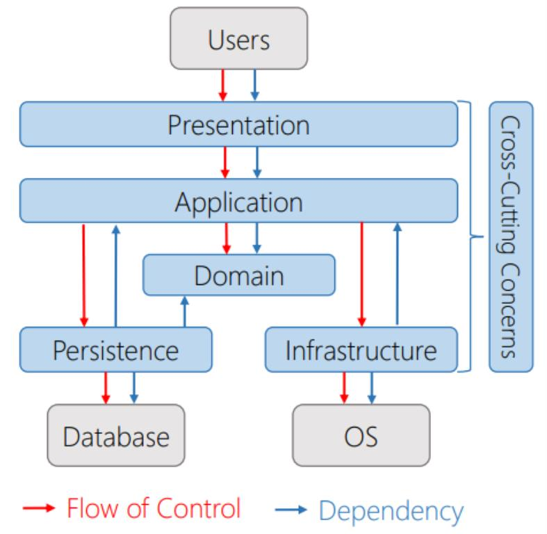

# Domain-driven design

## Requirements:
- [Windows 10, version 2004](https://docs.microsoft.com/en-us/windows/release-information)
- [Visual Studio Preview 2](https://visualstudio.microsoft.com/vs/preview)
    - .NET Desktop Development
    - Universal Windows Platform development
    - Windows 10 SDK (10.0.19041)
- [.NET SDK 5.0.100-preview.4](https://dotnet.microsoft.com/download/dotnet/5.0)
- [WinUI 3 Project Templates (Preview)](https://aka.ms/winui3/previewdownload)
    - [Windows UI Library 3.0 Preview 1 (May 2020)](https://docs.microsoft.com/en-us/windows/apps/winui/winui3)

## Directory structure

- UI = Presentation
- App = Application
- App.Interface
- App.Domain = Domain
- Data = Persistence
- Service = Infrastructure
- Common = Cross-Cutting Concerns
- Test

## Domain-driven design images

[Clean Architecture: An alternative to traditional three layer database centric applications.](http://www.pinte.ro/Blog/DesignPatterns/Clean-Architecture-An-alternative-to-traditional-three-layer-database-centric-applications/37) by Dani Pinte

[DDD, Hexagonal, Onion, Clean, CQRS, … How I put it all together](https://herbertograca.com/2017/11/16/explicit-architecture-01-ddd-hexagonal-onion-clean-cqrs-how-i-put-it-all-together) by Herberto

## Ports & Adapters

On the UI side (the driving adapters), we create adapters that use our application interfaces, ie. controllers.

On the infrastructure side (the driven adapters), we create adapters that implement our application interfaces, ie. repositories.

- Port = Interface
- Adapter = Class

See: [Ports & Adapters Architecture](https://herbertograca.com/2017/09/14/ports-adapters-architecture) by Herberto

## Other Stuff

https://github.com/microsoft/InventorySample